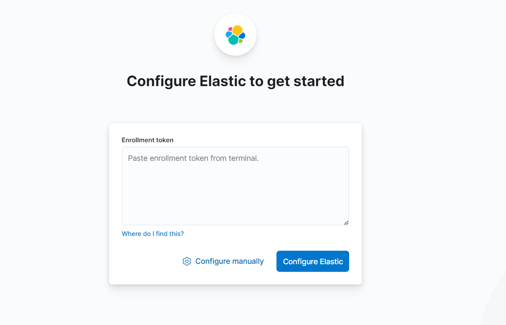
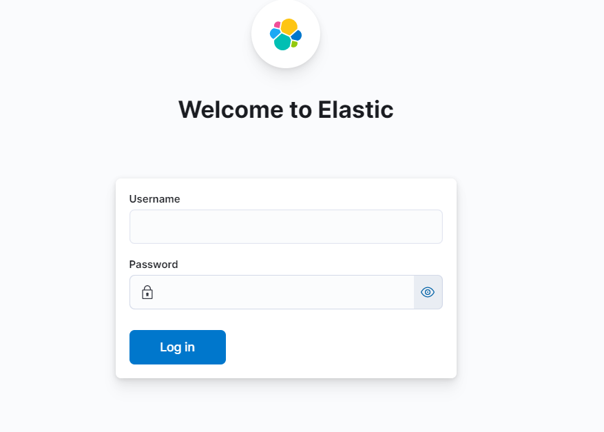
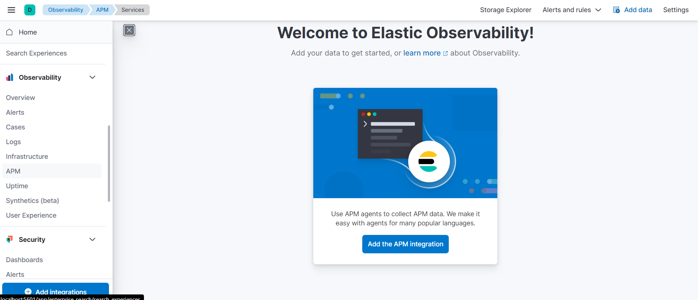
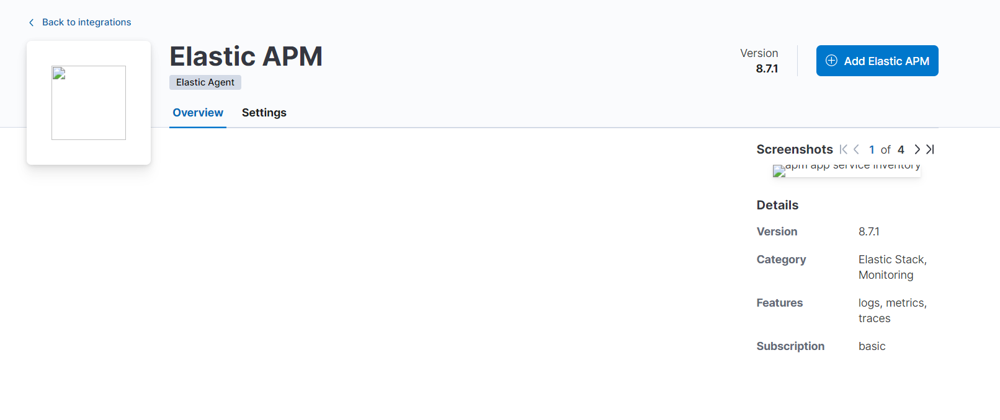
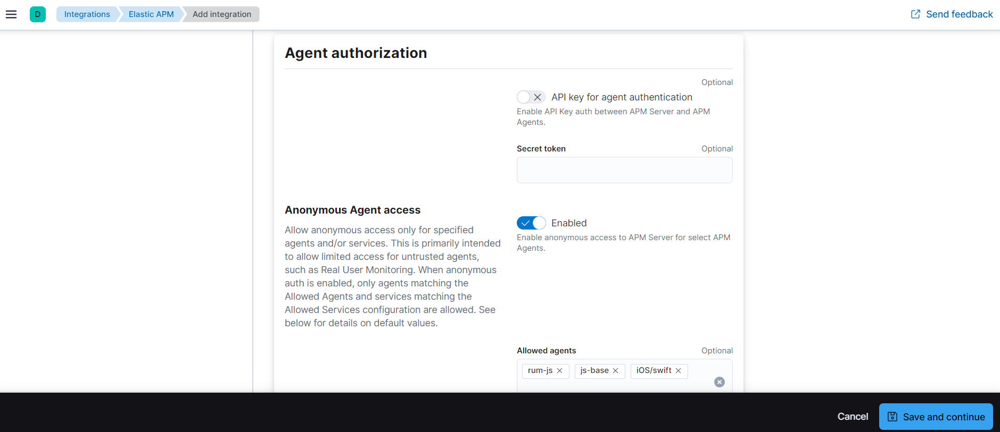
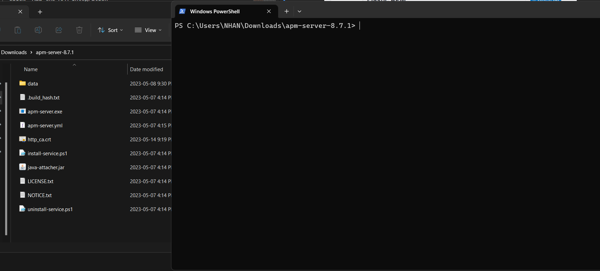
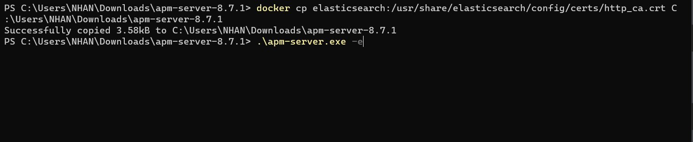
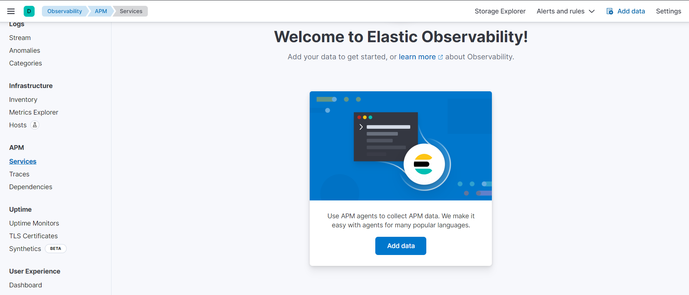
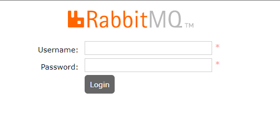

# Some example around elastic with Spring 2.7.x

## I. Requirement
- Java 17 or higher
- Maven 3.8.5 or higher

## I. Overview

This is a simple demo about spring and elastic.

## II. Installation

### 0. **Installation**

    - [Docker](https://www.docker.com/)

    **Step 1:** Run `springboot-docker/docker-compose.yml` to start RabbitMQ, Elastic and Kibana. Remove unused container if you don't need it

    ```powershell
        spring-boot-code-example> docker compose -f "springboot-docker\docker-compose.yml" up -d --build
    ```

### 1. **Elastic and Kibana**

    **Step 2.1:** Open `http://localhost:5601/` to login Kibana

    

    To get enrollment token, run below code
    ```powershell
        docker exec -it elasticsearch /usr/share/elasticsearch/bin/elasticsearch-create-enrollment-token -s kibana
    ```
    If kibana require **verification code**, you just watch kibana's log

    **Step 2.2:**
    
    username: elastic
    password: ngocnhan

    **Step 3.1:**
    To show this page, choose Menu -> Observability -> APM
    Click "Add the APM integration"
    

    **Step 3.2:**
    Click "Add Elastic APM"
    

    Click "Save and continue"
    

    **Step 3.3:**
    Download [**APM Server**](https://www.elastic.co/downloads/apm)
    Extract it and open cmd.
    **Example:** I extract in folder `C:\Users\NHAN\Downloads\apm-server-8.7.1`
    

    Copy cert from Elastic to APM
    ```powershell
        docker cp elasticsearch:/usr/share/elasticsearch/config/certs/http_ca.crt <Path>\apm-server-8.7.1
    ```
    **Example:**
    ```powershell
        docker cp elasticsearch:/usr/share/elasticsearch/config/certs/http_ca.crt C:\Users\NHAN\Downloads\apm-server-8.7.1
    ```

    **Step 3.4:**
    Run APM Server
    ```powershell
        ./apm-server -e
    ```
    

    **Step 3.5:**
    Go back **Step 3.1:** and check
    

### 2. **RabbitMQ**

    **Step 3.6:** Open `http://localhost:15672` to login RabbitMQ
    
    username: ngocnhan
    password: ngocnhan


## III. Getting Started

- Code Structure

    ```
        com
        +- springboot
            +- code
                +- example
                    +- elastic
                        +- ElasticApplication.java
                        |
                        +- consumer
                        |   +- MessageConsumer.java
                        +- config
                            +- ElasticApplicationConfig.java
    ```

- Run `ElasticApplication.java` to run application

- Push message to queue `local_QUEUE_TEST` or `local_QUEUE_TEST_LISTENER` and reload kibana to see result

- Run test: Updating

## IV Reference Guide

1. [Centralize spring boot log to ELK Elasticsearch, Logstash, Kibana](https://www.youtube.com/watch?v=hvYUwUmHB6M)